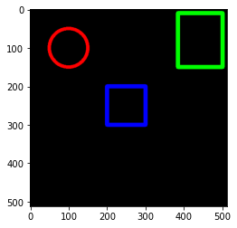

Lets use OpenCV library to draw some shapes on image files.

Spin up a new instance of Jupyter notebook.
Copy the cv2, numpy and matplotlib libraries into our instance.

```python
import cv2
import numpy as np
import matplotlib.pyplot as plt
%matplotlib inline
```

Now create an image or blank canvas to start drawing the shapes on.

```python
blank_img = np.zeros(shape=(512,512,3), dtype=int16)
```
use imshow function of matplotlib to show the blank canvas.


Lets draw a rectangle on the blank canvas.

```python
cv2.rectangle(blank_img,pt1=(384,10),pt2=(500,150),color=(0,255,0),thickness=10)
plt.imshow(blank_img)
```


As shown above, cv2 has a rectangle function that takes in certain parameters like image name,left corner coordinates, right corner coordinates, color of shape and thickness of the line.

Lets draw another rectangle at the center of canvas in a similar way and color it Blue(0,0,255)

```python
cv2.rectangle(blank_img,pt1=(200,200),pt2=(300,300),color=(0,0,255),thickness=10)
plt.imshow(blank_img)
```

Good, now lets see how we can draw a circle in a similar manner.

```python
cv2.circle(img=blank_img,center=(100,100),radius=50,color=(255,0,0),thickness=8)
plt.imshow(blank_img)
```


Lets draw and fill a circle.

```python
cv2.circle(img=blank_img,center=(400,400),radius=50,color=(255,0,0),thickness=-1)
plt.imshow(blank_img)
```


why not draw a line crossing them all?

```python
cv2.line(blank_img,pt1=(0,0),pt2=(512,512),color=(102,255,255),thickness=5)
plt.imshow(blank_img)
```


Scribble a text across the canvas. 

```python
font = cv2.FONT_HERSHEY_SIMPLEX
cv2.putText(blank_img,text='Hello',org=(10,500),fontFace=font,fontScale=4,color=(255,255,255),thickness=3,lineType=cv2.LINE_AA)
plt.imshow(blank_img)
```


Today, we learned how to draw a blank canvas and scribble some shapes using OpenCV & display them using python libraries.