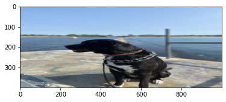

Images are represented by pixels on the screen. Each pixel can have a value varying from(0-255) across 3 channels(RGB).

without further ado, lets use OpenCV with python and learn to do interesting things with images.

I am using Jupyter Notebook for this tutorial.

First we need to import the required libraries.

numpy library is used to build arrays, do operations on arrays in python. Images are nothing but pixels and pixels are represented as arrays in memory.

matplot library is used to plot images in the editor.

```python
import numpy as np
import matplotlib.pyplot as plt
%matplotlib inline
import cv2

img = cv2.imread('puppy.jpg')
plt.imshow(img)
```
We read the image that is in same directory as the program using a built-in function imread of OpenCV.

imshow function of matplotlib is used to display the image in our IDE or editor.


The channels are flipped when we read the image using OpenCV. Image is read in BGR order. Lets fix it.

```python
fix_image = cv2.cvtColor(img,cv2,COLOR_BGR2RBG)
plt.imshow(fix_image)
```


Now, Lets read the image in Gray scale i.e remove the RGB channels while reading the image in using OpenCV.

```python
img_gray = cv2.imread('puppy.jpg', cv2.IMREAD_GRAYSCALE)

plt.imshow(img_gray,cmap='gray')
```


Lets check the size of our image, shall we?

```python
img_gray.shape
```
(4032,3024)

Lets change the size of our image.
```python
new_img = cv2.resize(fix_image,(1000,400))
plt.imshow(new_img)
```


We used resize method from cv2 to change the width & height of the image.

**Code & topics are from Jose, Portilla Udemy course on CV.
